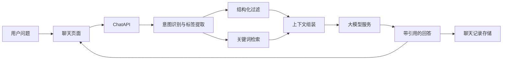

# AI前辈 V1 计划

## 结论

- 你的整体逻辑是合理的，但顺序需要微调。
- 推荐顺序不是“先拿模型 API，再想数据库”，而是：
  1. 明确 V1 用户场景和最小功能边界。
  2. 先设计“师兄师姐经验数据”的结构化 schema。
  3. 先把资料入库和检索跑通。
  4. 再接入大模型，把检索结果拼成上下文。
  5. 最后做以聊天框为中心的网页联调。
- 原因：如果没有先定义数据结构和检索路径，大模型只能“会说话”，但不能稳定回答“实习/保研/规划”这类需要证据来源的问题。

## 对 `cheese-backend` 的判断

- 这个仓库适合借鉴为“轻量 AI 产品后端骨架”，不适合直接当成 AI前辈成品后端。
- 最值得复用的是基础设施，而不是问答业务本身。

## 可借鉴模块

- 项目骨架与工程化：`[package.json](package.json)`
  - 已有 `NestJS + Prisma + PostgreSQL + Redis` 的后端基础，适合继续作为 V1 后端技术栈。
- 全局模块组织：`[src/app.module.ts](src/app.module.ts)`
  - 可以借鉴它的模块化拆分、全局校验、全局异常处理和拦截器组织方式。
- 启动与会话/CORS：`[src/main.ts](src/main.ts)`
  - 可借鉴 CORS、cookie、session、Redis store 的接入方式。
  - 但 V1 可以先简化，只保留 JWT 或 JWT + refresh token，不必保留复杂 session 流程。
- 环境配置：`[src/common/config/configuration.ts](src/common/config/configuration.ts)`
  - 很适合直接借鉴成你自己的配置中心，并新增 LLM、embedding、上传等配置项。
- 鉴权思路：`[src/auth/auth.service.ts](src/auth/auth.service.ts)`
  - JWT、权限校验、统一错误处理的思路值得保留。
  - 但 SRP、sudo、复杂权限模型对 V1 太重，应大幅删减。
- 邮件模块：`[src/email/email.module.ts](src/email/email.module.ts)`
  - 可作为“注册验证码/找回密码/通知邮件”的后续能力。
  - 如果 4.15 工期紧，邮箱验证不是第一优先级，可以延后到 V1.1。

## 不建议复用的部分

- 问答域模型与业务模块：`questions`、`answer`、`groups`、`comments`、`materials` 等。
- 高复杂认证：OAuth、TOTP、WebAuthn、SRP。
- Elasticsearch 重型搜索链路。
- 这套仓库的核心是社区问答，不是“知识库检索 + 聊天助手”，直接继承会拖慢你。

## 推荐的 V1 技术路线

- 后端：继续用 `NestJS + Prisma + PostgreSQL`。
- 鉴权：做轻量账号系统，只保留注册/登录/个人信息/历史聊天。
- 检索：V1 优先做“结构化过滤 + 关键词检索”，不要一开始就上很重的 ES 架构。
- 向量检索：如果你能稳定接入 `pgvector`，可在第二阶段补上 embeddings；否则先用标签、分类和关键词召回把 MVP 跑通。
- 大模型接入：在后端新增 AI 服务层，负责：
  - 用户问题分类
  - 检索相关资料
  - 拼接上下文
  - 调用模型生成回答
  - 返回引用来源
- 前端：以中央聊天框为核心，登录、个人主页、历史聊天围绕它服务。

## 推荐的 V1 数据模型

- `User`
  - 基础账号信息。
- `UserProfile`
  - 学校、年级、专业、目标方向、个人标签。
- `SeniorProfile`
  - 师兄师姐基础画像，如学校、专业、毕业去向、研究方向。
- `ExperienceEntry`
  - 单条经验内容，如实习经历、保研经验、选课建议、科研建议、求职建议。
- `Tag`
  - 用于标记主题，如 `保研`、`大厂实习`、`科研`、`转码`、`简历`。
- `Conversation`
  - 用户的一次聊天会话。
- `Message`
  - 聊天消息，记录用户问题、AI 回答、引用来源。
- `SourceReference`
  - AI 回答引用到了哪些 `ExperienceEntry`。

## 推荐的回答链路

## 4.15 前的范围建议

- 必做：
  - 用户注册/登录
  - 个人主页
  - 师兄师姐资料入库
  - AI 聊天问答
  - 历史聊天
  - 回答中展示参考来源
- 建议延后：
  - 邮箱验证码/找回密码
  - OAuth 第三方登录
  - 向量数据库重构
  - 复杂后台管理台
  - 多模态上传

## 两周排期

### 4.1 - 4.3：产品与数据打底

- 明确 V1 只回答哪三类核心问题：实习、保研、未来规划。
- 设计数据库 schema 和资料收集模板。
- 从现有仓库中提炼可复用的基础模块，建立轻量新后端骨架。
- 产出：Prisma 模型、接口清单、页面草图。

### 4.4 - 4.6：用户系统与资料管理

- 完成注册、登录、JWT 鉴权。
- 完成个人主页的基础字段。
- 完成师兄师姐资料的录入方式：优先后台表单或脚本导入 CSV/JSON。
- 产出：用户可登录，资料可进库。

### 4.7 - 4.10：检索与 AI 问答

- 实现问题标签提取和检索逻辑。
- 实现 Chat API：接收问题、召回资料、组装 prompt、调用模型、返回答案。
- 让回答带上引用资料标题/标签/来源。
- 产出：能围绕真实资料回答问题，而不是纯模型自由发挥。

### 4.11 - 4.13：前端页面联调

- 完成登录页、主页、中央聊天页、历史聊天页。
- 优先保证聊天交互顺畅和来源展示清晰。
- 产出：可演示网页版本。

### 4.14 - 4.15：测试与演示打磨

- 修复高频问题。
- 补充种子数据。
- 优化提示词、回答格式、空结果提示。
- 完成一套演示脚本。

## 风险与规避

- 最大风险不是模型，而是数据质量。
  - 解决方式：先统一资料模板，要求每条经验都带时间、背景、方向、结果、适用对象。
- 第二风险是范围过大。
  - 解决方式：V1 不追求“所有账号功能”，只保留最小登录体系。
- 第三风险是检索效果差。
  - 解决方式：先强制结构化标签，不要把所有内容都当长文本直接喂给模型。

## 我建议的落地策略

- 保留 `cheese-backend` 的技术栈思路。
- 删除它的社区问答业务层。
- 新建你自己的轻量模块：`auth`、`users`、`profiles`、`knowledge`、`chat`、`ai`。
- 第一版不要把精力浪费在复杂认证和重型搜索引擎上，先把“有依据地回答问题”做出来。

